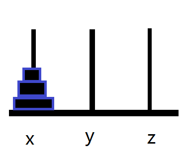
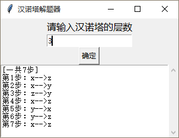

下图是汉诺塔游戏的简单图示，我们要把x柱子上面的移动到z轴上面（汉诺塔游戏规则可以自行搜索，这里不做介绍）



需要引入tkinter和ScrolledText模块，下面直接贴代码（我用的是python3.6）。

```
import tkinter
from tkinter.scrolledtext import ScrolledText
root = tkinter.Tk()
root.title('汉诺塔解题器')
root.geometry('300x200')
root.resizable(width=False, height=True)
tkinter.Label(root, text='请输入汉诺塔的层数', font=('微软雅黑', 12)).pack()
var = tkinter.StringVar()
e = tkinter.Entry(root, textvariable = var)
e.pack()
t = tkinter.scrolledtext.ScrolledText(root)
ans = []
def hanoi(n, x, y, z):
    if n == 1 :
        ans.append(x + '-->' + z)
    else :
       hanoi(n-1, x, z, y) #将前n-1个盘子从x移动到y上
       ans.append(x + '-->' + z) #将最底下的最后一个盘子从x移动到z上
       hanoi(n-1, y, x, z) #将y上的n-1个盘子移动到z上
    return ans
def calc() :
    del ans[:]
    n = int(var.get())
    str2 = hanoi(n, 'x', 'y', 'z')
    t.delete(0.0, tkinter.END)
    count = 0
    for stre in str2 :
        count = count + 1
        t.insert(tkinter.END, '第' + str(count)  + '步：' + stre + '\n')
    t.insert(1.0, '[一共' + str(count) + '步]\n')
    t.pack()
tkinter.Button(root, text="确定", command=calc).pack()
root.mainloop()
```

然后运行之后结果如下图，比如输入汉诺塔的层数为3，然后点击确定按钮下面就会显示出详细的步骤。

