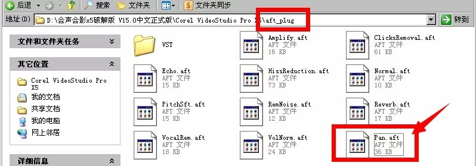
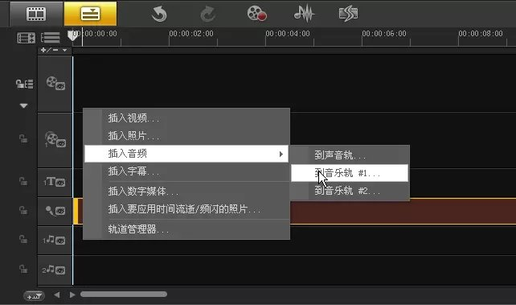
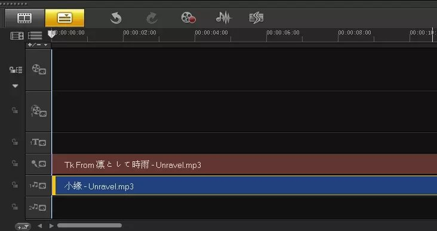
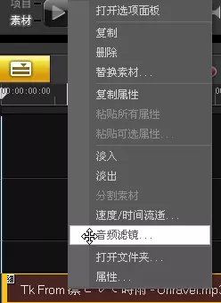
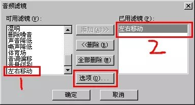
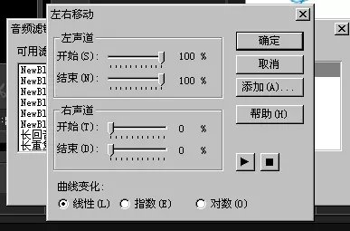
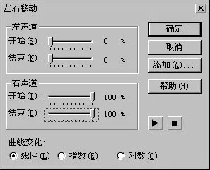
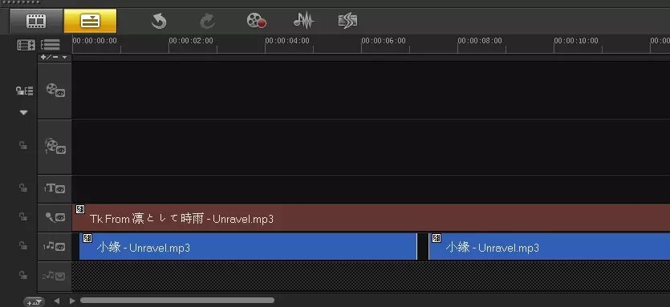
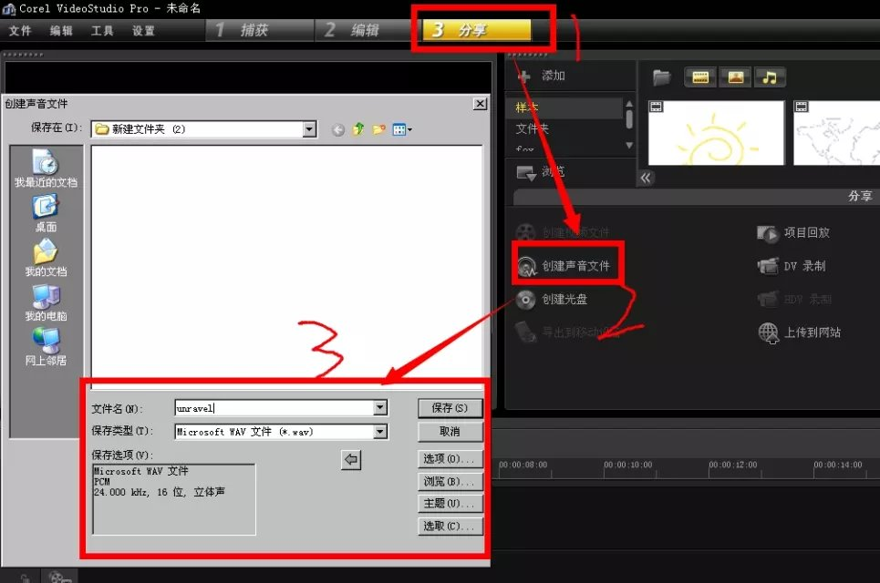

第一步：下载会声会影的“左右移动”音频滤镜（Pan.aft），把它放在会声会影的安装目录中。

第二步：打开会声会影，把你的素材即两首歌曲分别导入到声音轨和音乐轨（当然两个都导入到音乐轨也可以）。下面导入的就是我要用到的歌曲。

第三步：将第一首歌曲做如下的设置。首先选择第一首歌曲，鼠标右键，然后点击【音频滤镜】

选择【左右移动滤镜】（双击它就行了），然后点击图片中间的选项

点击【选项】弹出下图的面板，把参数设置成下图所示的，然后点击【确定】——【确定】（即是两个面板都点击确定）。

第四步：设置第二首歌曲的音频滤镜，步骤和第三步一样，只是在最后设置左右移动滤镜的参数的时候设置的参数不同，参数改为如下图所示

第五步：自己调整两首歌的时间轴，使歌曲能够同步播放，例如我这样。

第六步：导出最后的效果，也就是渲染成音频文件。

（ps：本教程是我在网上搜集资料再重新编写的，只作个人学习交流用途，不得转载传播）

好吧我只是想以后要是想做怕忘了步骤所以才把它写成一个教程，以后忘了也可以看一看哈哈哈哈哈哈哈 
