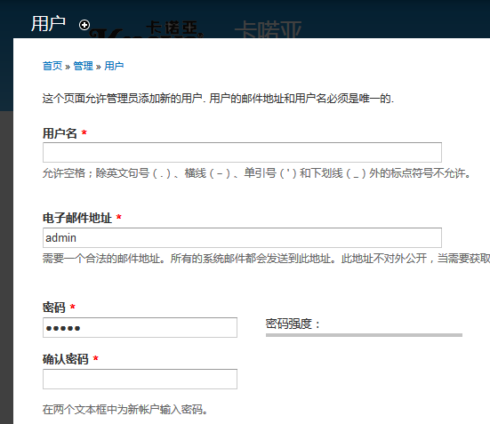
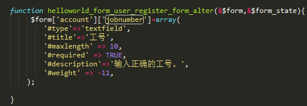
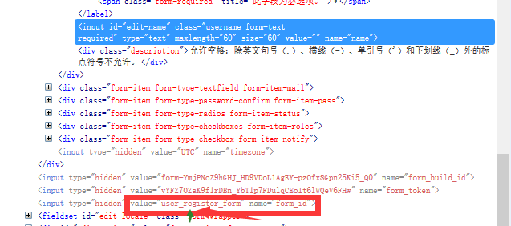
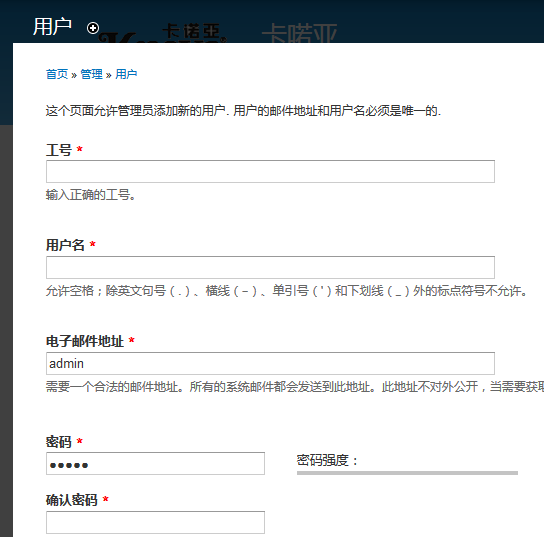

例如在以下页面新增一个工号字段

在模块文件里面通过hook_form_FORM_ID_alter 函数修改，比如

图中的helloworld是模块名称，也就是你在哪个模块里面写这个函数那么名称就是什么（此例子在helloworld.module写的），user_register_form是你要修改或者新增的form的id，注意是form的id，通过浏览器的开发者工具可以看到。

也就是说格式为模块名_form_要修改form的id_alter。修改后如下图：

可以用hook_form_alter函数也可以，这个可以修改多个form，例如可以通过if语句判断form的id，来确定要修改哪个form。
 
（注：我是一个新手菜鸟，第一次写博客，主要是分享和巩固自己的知识，也是把学习过程记下来，如果文中有哪些写的不对的地方非常欢迎各位帮我指出^_^）
